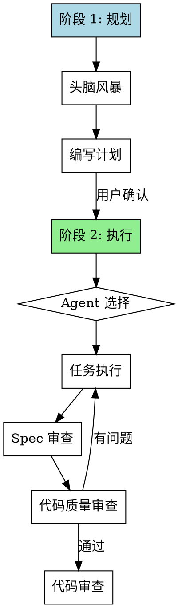

# 混合开发工作流

结合 Claude Code 的设计和沟通能力与 Codex 的编程能力的自定义 AI 开发工作流。此工作流提供**手动触发**和**阶段确认**，由开发者全程掌控。

## 核心理念

| 方面 | 传统方式 | 混合工作流 |
|------|----------|-----------|
| 触发 | 自动执行 | 手动 `/hybrid-design-dev` |
| 流程控制 | 强制下一步 | 阶段确认 |
| 代码编写 | 单一 Agent | 强制使用 Codex MCP |
| 审查 | 固定流程 | 可配置 Agent 执行 |

## 工作流阶段



## 使用方式

### 命令: `/hybrid-design-dev`

启动新的混合开发工作流：
- 使用 Claude Code 进行头脑风暴
- 以阶段确认结束再进入规划
- 详见 `skills/hybrid-planning/SKILL.md`

### 命令: `/hybrid-workflow`

从特定阶段继续：
- 从上次离开的地方继续
- 如果规划已完成可直接跳到执行阶段

### 命令: `/hybrid-lite-dev`

小型任务的快速开发：
- 简化版 spec（1-2 句话）
- 最多 3 个任务，直接执行
- 详见 `skills/hybrid-quick-dev/SKILL.md`

## 核心功能

### 1. 手动触发 + 阶段确认

- 使用 `/hybrid-design-dev` 启动 - 从不自动触发
- 每个阶段结束时需用户明确确认
- 开发者全程掌控节奏

### 2. 双 Agent 协作

- **Claude Code**：设计、规划、沟通
- **Codex**：编程、代码实现
- 每步互相验证

### 3. Codex 可用性检测（强制执行）

**在用户确认执行开发任务后，必须先进行 Codex 可用性检测：**

1. **立即检测**：用户确认执行后，立即尝试连接 Codex MCP
2. **最多尝试3次**：如果连接失败，间隔 2 秒后重试，最多尝试 3 次
3. **失败后回退**：3 次都失败后，才回退到 Claude Code 自己编写
4. **禁止跳过**：这个检测过程不可跳过，除非用户明确指示使用 Claude Code

**检测方法：**
```java
// 尝试调用 Codex MCP 的 ping 功能
mcp__codex-mcp-server__codex // 如果可用则继续
```

**执行流程：**
1. 用户确认执行开发任务后
2. **立即检测 Codex 可用性**（最多 3 次重试）
3. 如果 Codex 可用 → 调用 Codex 执行代码编写
4. 如果 Codex 不可用 → 回退到 Claude Code 编写
5. **完成后必须通知用户**：明确告知代码是由 Codex 还是 Claude Code 编写的
6. Codex 完成编写后，进行代码审查
7. 如有问题，修复后重新提交

### 4. 完成后验证与通知

每个关键节点必须验证：

| 节点 | 验证内容 |
|------|----------|
| 设计完成 | Spec 已保存到文件 |
| 计划完成 | 计划文件已保存 |
| 任务完成 | 测试通过，代码已提交 |
| Spec 审查通过 | 代码符合设计 |
| 代码审查通过 | 代码质量达标 |
| 分支完成 | 所有测试通过，审查通过 |

**完成后必须通知用户：**
- 明确告知代码是由 **Codex** 还是 **Claude Code** 编写的
- 使用格式："(本代码由 Codex/Claude Code 实现)"

## 核心原则

1. **手动触发**：`/hybrid-design-dev` 启动工作流，从不自动启动
2. **阶段确认**：每个阶段结束需用户批准后才能继续
3. **Codex 强制检测**：执行前必须检测 Codex 可用性（最多3次），不可跳过
4. **优先使用 Codex**：Codex 可用时必须使用，失败才回退到 Claude Code
5. **双 Agent 互补**：Claude Code 设计 + Codex 实现 = 互相验证
6. **证据驱动**：每个步骤都必须有验证
7. **TDD 必需**：所有实现必须先测试后代码

## 相关技能

- `hybrid-planning` - 规划阶段技能
- `hybrid-execution` - 执行阶段技能
- `hybrid-quick-dev` - 快速开发模式
