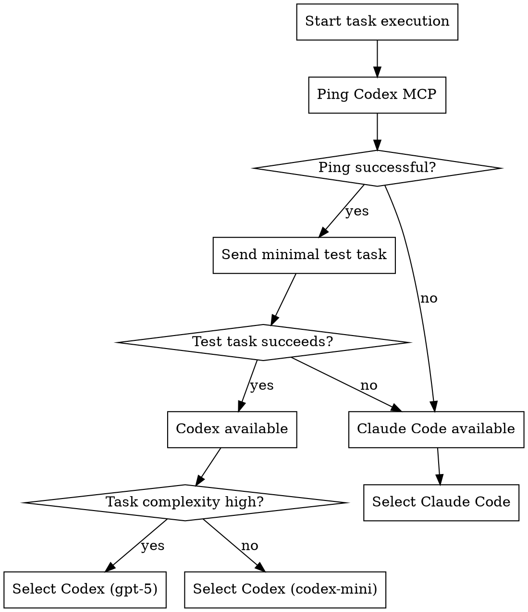
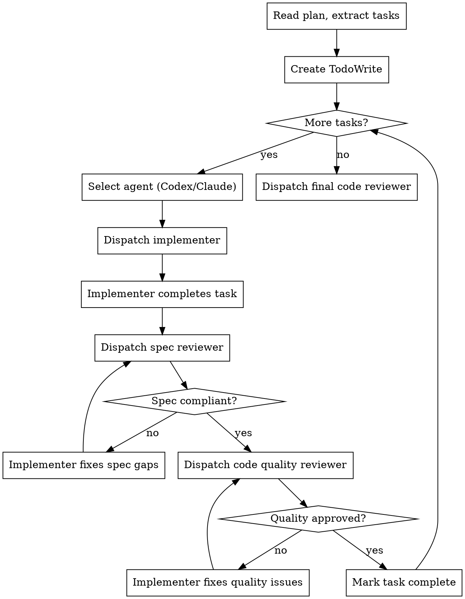

# Hybrid Execution

## Required Permissions

To use Codex MCP for task execution, add the following to your user-level `~/.claude/settings.json`:

```json
{
  "permissions": {
    "allow": [
      "mcp__codex-mcp-server__ping",
      "mcp__codex-mcp-server__ask-codex",
      "mcp__codex-mcp-server__batch-codex",
      "mcp__codex-mcp-server__version",
      "Bash(codex:*)",
      "Bash(gpt-5:*)",
      "Bash(o3:*)",
      "Bash(o4-mini:*)",
      "Bash(codex-mini-latest:*)"
    ]
  }
}
```

Without these permissions, Codex MCP calls will fail with "sandbox policy" error.

Execution phase of the hybrid development workflow. Handles agent selection, task execution with TDD, and multi-stage review.

**When triggered:** After user confirms from planning phase

## Agent Selection Logic

Before each task, dynamically select the appropriate agent:



### Codex Availability Check

**Step 1: Ping**
```typescript
// Try pinging Codex MCP
await mcp__codex-mcp-server__ping();
```

**Step 2: Actual Task Test** (if ping succeeds)
```typescript
// Send minimal task to verify actual availability
await mcp__codex-mcp-server__ask-codex({
  prompt: "Reply with 'OK'",
  timeout: 5000
});
```

### Agent Selection Matrix

| Codex Available | Task Complexity | Selected Agent | Model |
|-----------------|-----------------|----------------|-------|
| Yes | High | Codex | gpt-5 |
| Yes | Normal | Codex | codex-mini-latest |
| No | Any | Claude Code | default |

### Auto-Fallback

If Codex becomes unavailable during execution:
1. Log the failure
2. Switch to Claude Code
3. Continue remaining tasks
4. Report switch at end

## Task Execution Flow



## Per-Task Process

### 1. Agent Selection

Before each task:
1. Check Codex availability (ping + test)
2. Select agent based on availability + complexity
3. Log selection decision

### 2. Dispatch Implementer

**If Codex selected:**
- Use `codex-implementer-prompt.md`
- Use the **Codex Prompt Template** below to ensure stable execution
- Use `fullAuto: true` parameter (IMPORTANT: `sandbox: true` does NOT work reliably, use `fullAuto: true` instead)
- Dispatch via `mcp__codex-mcp-server__ask-codex`

**If Claude Code selected:**
- Use `claude-implementer-prompt.md`
- Dispatch via Agent tool (general-purpose)

### Codex Prompt Template (Required for Stability)

When calling Codex, ALWAYS wrap the task with this template to prevent token overflow:

```
【任务要求】
1. 直接创建/修改文件到项目目录
2. 完成后返回以下格式（每行一个文件）：
   - 成功：SUCCESS | 文件路径 | 功能描述
   - 失败：FAILED | 错误原因
【任务内容】
{task}
```

**Example output:**
```
SUCCESS | src/main/java/.../School.java | 实体类，包含name/region/address等字段
FAILED | src/main/java/.../SchoolService.java | 缺少依赖类BasePageRequest
```

**MCP Call Example:**
```typescript
await mcp__codex-mcp-server__ask-codex({
  prompt: "【任务要求】...\n【任务内容】\n创建 Student.java 实体类",
  fullAuto: true,  // IMPORTANT: sandbox:true does NOT work, use this instead
  timeout: 60000
});
```

### Task Assessment Strategy

Before calling Codex, assess the task to determine execution strategy:

| Scenario | Strategy |
|----------|----------|
| Single task | Execute directly |
| 2-3 independent small tasks | Can parallelize (subagent) |
| >3 tasks or complex task | Execute one by one |
| Tasks have dependencies | Must be sequential |

**Decision authority:** The main agent has full control. Choose the most stable approach while maximizing efficiency.

### Result Parsing & Error Handling

After Codex returns:
1. **Parse the response** - Look for `SUCCESS` or `FAILED` markers
2. **Verify files exist** - Check created files actually exist
3. **Handle failures:**
   - Missing dependency → Skip or log, continue next
   - File conflict → Ask user or auto-overwrite
   - Syntax error → Log, try fix or skip
   - Token overflow → Split into smaller tasks and retry

### Execution Strategy Guidelines

The main agent controls whether to use serial or parallel execution. Guidelines:

- **Stability first** - Prefer slower but more reliable approaches
- **Serial execution** - Default for most tasks (one Codex call at a time)
- **Parallel execution** - Only when tasks are truly independent and small
- **Subagent delegation** - Can use subagents for parallel execution, each following the Codex Prompt Template

### 3. Implementer Completes Task

Implementer follows TDD:
1. Write failing test
2. Verify test fails
3. Write minimal implementation
4. Verify test passes
5. Commit

### 4. Dispatch Spec Reviewer

**All agents use same prompt:** `spec-reviewer-prompt.md`

Reviewer verifies:
- All requirements implemented (no missing)
- Only requirements implemented (no extra)
- Implementation matches intent

### 5. Dispatch Code Quality Reviewer

**Default: Codex executes** - better at code analysis
- Use `code-quality-reviewer-prompt.md`

Reviewer verifies:
- Naming clarity
- Test coverage
- DRY/YAGNI principles
- No hardcoded values

### 6. Handle Issues

- **Spec issues:** Implementer fixes → Re-review
- **Quality issues:** Implementer fixes → Re-review
- **Max iterations:** 5 per review type, then escalate to human

## User Intervention

After user confirms execution:

> "Starting autonomous execution. You can:"
> - Say "stop" or "abort" to pause
> - Say "status" to check progress
> - Say "show task N" to see implementation details

### Commands During Execution

| Command | Action |
|---------|--------|
| `stop` / `abort` | Pause execution, ask what to do |
| `status` | Show current task, progress |
| `show task N` | Display task details + implementation |
| `skip` | Skip current task (with reason) |

## Final Code Review

After all tasks complete:

1. Get git SHA range (first commit to last)
2. Dispatch final code reviewer
3. Use `superpowers:requesting-code-review` template

## Completion

Report final status:
- Tasks completed / total
- Commits made
- Any issues found
- Recommendation for next steps

## Verification Checklist

Before marking task complete:
- [ ] Implementer reported DONE
- [ ] All tests passing
- [ ] Code committed
- [ ] Spec reviewer approved
- [ ] Code quality reviewer approved

Before marking workflow complete:
- [ ] All tasks complete
- [ ] All tests passing
- [ ] Code review passed
- [ ] User notified of completion
