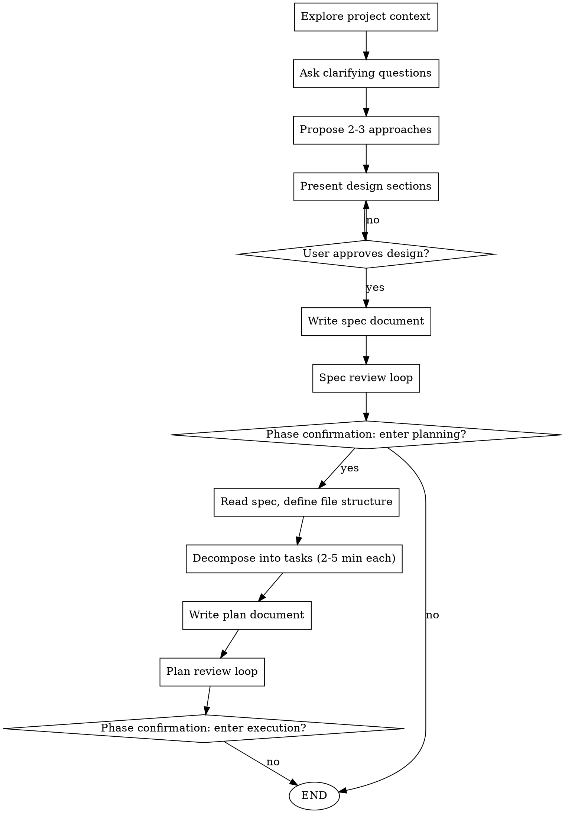

# Hybrid Planning

Planning phase of the hybrid development workflow. This skill handles brainstorming and writing implementation plans using Claude Code's strengths in design and communication.

**Who executes:** Claude Code (designer)
**When triggered:** `/hybrid-design-dev` or after hybrid-dev-workflow confirmation

## Process Flow



## Phase 1: Brainstorming

### Trigger: `/hybrid-design-dev`

**Executor:** Claude Code (excellent at conversation, understanding requirements)

### Steps

1. **Explore project context** - Check files, docs, recent commits
2. **Ask clarifying questions** - One at a time, understand purpose/constraints/success criteria
3. **Propose 2-3 approaches** - With trade-offs and your recommendation
4. **Present design sections** - Scaled to complexity, get approval after each section
5. **Write spec document** - Save to preferred location
6. **Spec review loop** - Dispatch spec reviewer until approved

### Phase Confirmation

After spec review passes, ask:

> "Design complete. Spec saved to `<path>`.
> Ready to enter writing-plans phase to decompose this into an implementation plan?"

**Only proceed if user confirms.**

### Forbidden Actions

- ❌ Write any implementation code before user approves design
- ❌ Auto-proceed to next phase without confirmation

## Phase 2: Writing Plans

### Trigger: User confirms entering this phase

**Executor:** Claude Code (better at task decomposition and communication)

### Steps

1. **Read spec document** - Full understanding
2. **Define file structure** - Map files to responsibilities
3. **Decompose into tasks** - Each task 2-5 minutes, includes:
   - Exact file paths
   - Complete code (not "add validation")
   - Test commands with expected output
   - Commit commands

### Task Structure

```markdown
### Task N: [Component Name]

**Files:**
- Create: `exact/path/to/file.ts`
- Modify: `exact/path/to/existing.ts:123-145`
- Test: `tests/exact/path/to/test.ts`

- [ ] **Step 1: Write failing test**
```typescript
test('specific behavior', async () => {
  const result = await function(input);
  expect(result).toBe(expected);
});
```

- [ ] **Step 2: Run test to verify failure**
```bash
npm test tests/path/test.ts
# Expected: FAIL - function is not defined
```

- [ ] **Step 3: Write minimal implementation**
```typescript
export async function function(input) {
  return expected;
}
```

- [ ] **Step 4: Run test to verify pass**
```bash
npm test tests/path/test.ts
# Expected: PASS
```

- [ ] **Step 5: Commit**
```bash
git add src/path/file.ts tests/path/test.ts
git commit -m "feat: add specific feature"
```
```

### Phase Confirmation

After plan is complete:

> "Plan complete, N tasks in total. Once confirmed, the AI will execute all tasks autonomously - no further questions. You can stop or abort anytime. Ready to execute?"

**Only proceed if user confirms.**

## Spec Document Location

- **Default:** `docs/superpowers/specs/YYYY-MM-DD-<feature>-design.md`
- **User preference:** Override default if user specifies different location

## Plan Document Location

- **Default:** `docs/superpowers/plans/YYYY-MM-DD-<feature>.md`
- **User preference:** Override default if user specifies different location

## Verification Checklist

Before phase confirmation, verify:

- [ ] Spec document exists at specified path
- [ ] Spec passes review loop (max 5 iterations)
- [ ] User has reviewed and approved spec
- [ ] Plan document exists at specified path
- [ ] All tasks have complete code (not stubs)
- [ ] All tasks have test commands with expected output

## Transition to Execution

After user confirms execution phase, invoke:
- `hybrid-execution` skill for task execution
- Do NOT invoke any other skill
