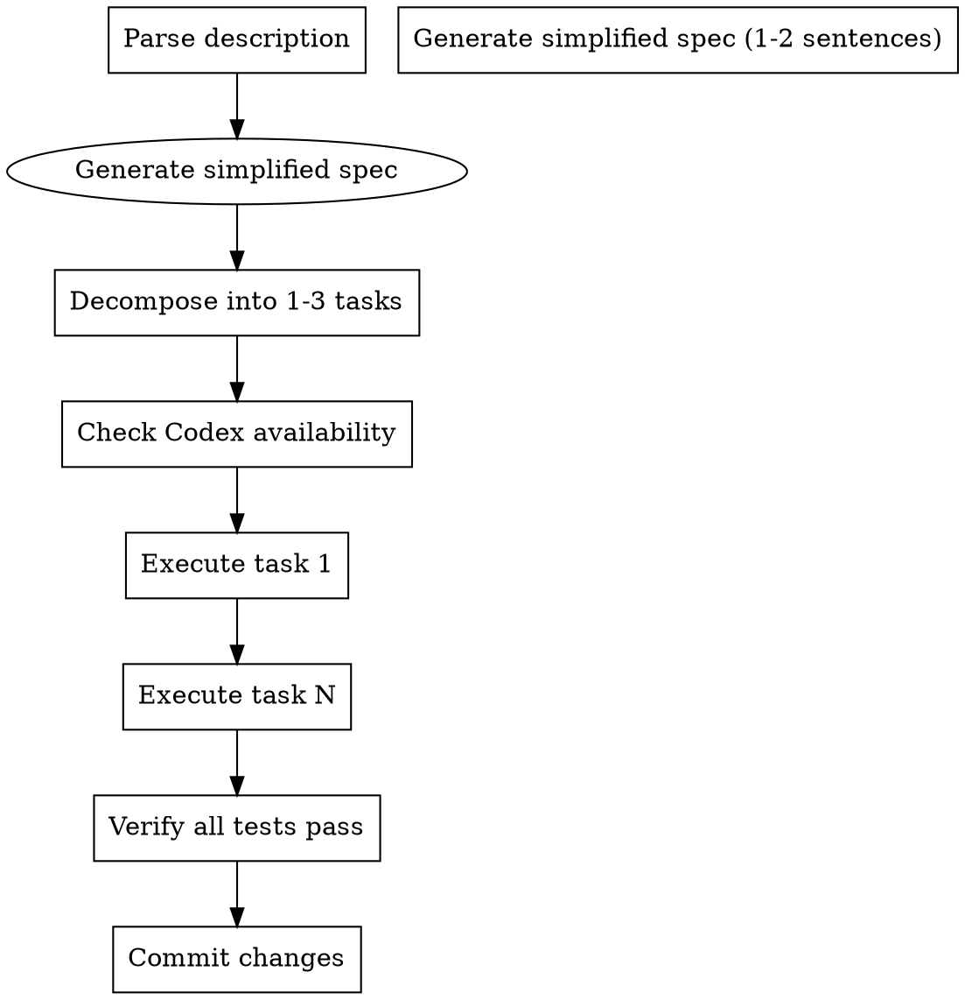

# Hybrid Quick Dev

Quick development mode for small, independent tasks that don't need full brainstorming + planning workflow.

**When to use:** Small features, simple bug fixes, isolated changes
**When NOT to use:** Complex features, multi-file changes, architectural work

## Command

```
/hybrid-lite-dev <feature description>
```

## When to Use

| Scenario | Use hybrid-lite-dev | Use full workflow |
|----------|---------------------|-------------------|
| Add simple API endpoint | ✅ | ❌ |
| Fix small bug | ✅ | ❌ |
| Add validation to form | ✅ | ❌ |
| Create new component | ⚠️ | ⚠️ |
| Multi-file feature | ❌ | ✅ |
| Architectural change | ❌ | ✅ |

**Rules:**
- Max 3 tasks
- Single responsibility
- No architecture changes
- No multi-file refactoring

## Process



## Simplified Spec

```markdown
# Hybrid Quick Dev: [Feature Name]

**Spec:** [1-2 sentence description of what to build]

**Constraints:**
- Max 3 tasks
- No architecture changes
- Follow existing patterns
```

## Simplified Task Structure

```markdown
### Task N: [Description]

**Files:**
- Modify: `src/file.ts`

- [ ] **Step 1: Write failing test**
- [ ] **Step 2: Verify failure**
- [ ] **Step 3: Write implementation**
- [ ] **Step 4: Verify pass**
- [ ] **Step 5: Commit**
```

## Agent Selection

Same logic as hybrid-execution:
1. Check Codex availability
2. If available → use Codex (with `fullAuto: true` parameter)
3. If unavailable → use Claude Code

## Codex Prompt Template (Required for Stability)

When calling Codex, ALWAYS wrap the task with this template to prevent token overflow:

```
【任务要求】
1. 直接创建/修改文件到项目目录
2. 完成后返回以下格式（每行一个文件）：
   - 成功：SUCCESS | 文件路径 | 功能描述
   - 失败：FAILED | 错误原因
【任务内容】
{task}
```

**Example output:**
```
SUCCESS | src/main/java/.../School.java | 实体类，包含name/region/address等字段
FAILED | src/main/java/.../SchoolService.java | 缺少依赖类BasePageRequest
```

## Task Execution Strategy

For quick dev (max 3 tasks), the main agent decides execution approach:

- **Single task** → Direct execution
- **2-3 independent tasks** → Can parallelize or serial (main agent decides)
- **If any task fails** → Log error, continue with remaining tasks
- **Verify files** → After execution, check files exist

## Example

```
/hybrid-lite-dev add email validation to login form
```

**Spec generated:**
> Add email validation to the login form. Validate format before submit, show error message for invalid emails.

**Tasks:**
1. Add validation function
2. Integrate with form
3. Add error display

## Limitations

- Max 3 tasks
- No design review
- No plan review
- Single session execution
- No complex integrations

## Completion

Report:
- Tasks completed
- Tests passing
- Changes committed
